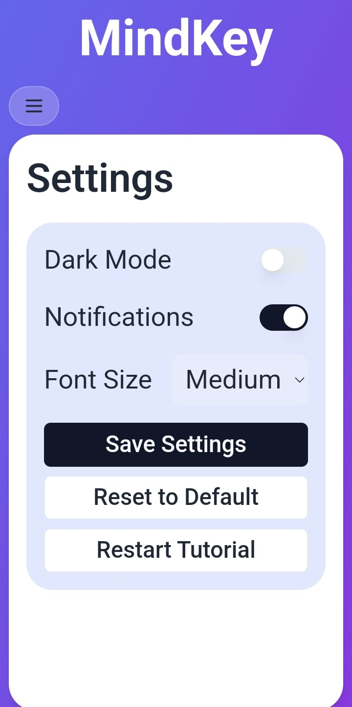
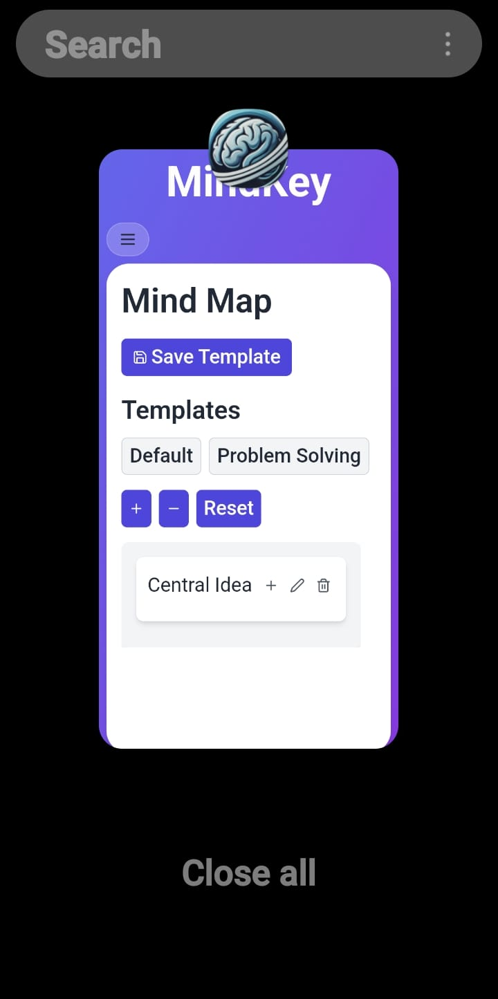
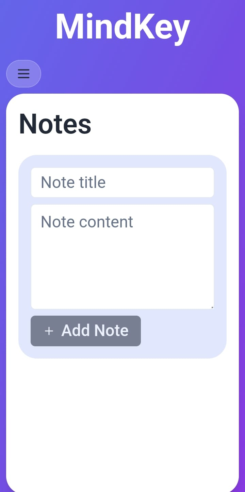
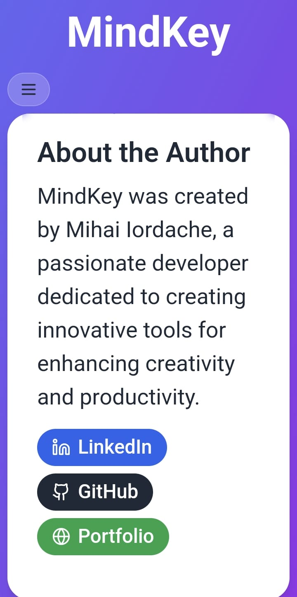
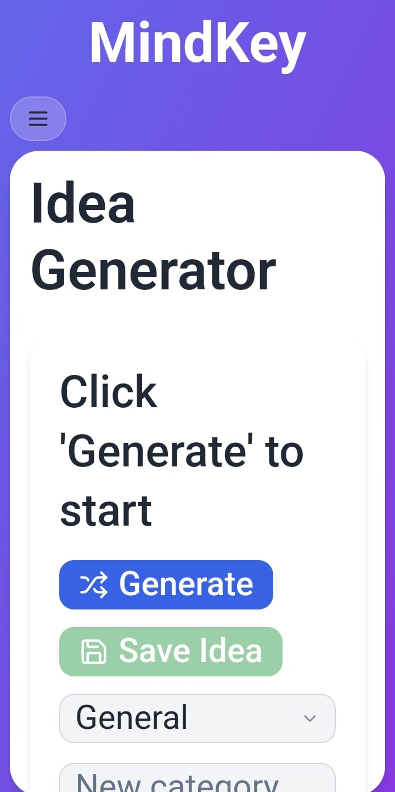
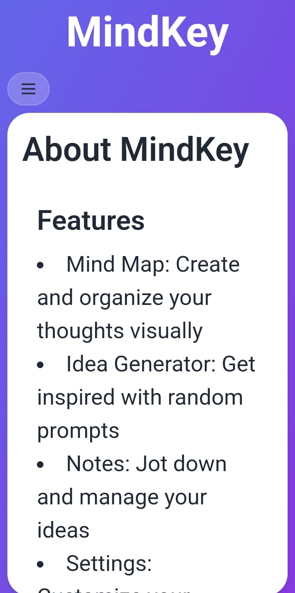
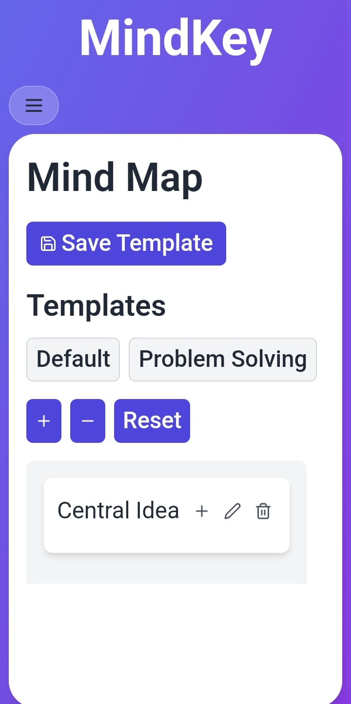

# MindKey

MindKey is an innovative tool designed to enhance creativity and productivity. It allows users to create and organize their thoughts visually, get inspired with random prompts, jot down and manage their ideas, and customize their experience.

The app is an android application built using capacitor but it can still be run locally. 

## Features

- **Mind Map**: Create and organize your thoughts visually.
- **Idea Generator**: Get inspired with random prompts.
- **Notes**: Jot down and manage your ideas.
- **Settings**: Customize your MindKey experience.

## About the Author

MindKey was created by Mihai Iordache, a passionate developer dedicated to creating innovative tools for enhancing creativity and productivity.

## Screenshots









## Getting Started

To get started with MindKey, follow these steps:

1. Clone the repository:
    ```sh
    git clone https://github.com/bogdansys/mindkey
    ```
2. Install dependencies:
    ```sh
    npm install
    ```
3. Start the development server:
    ```sh
    npm run dev
    ```

## License

This project is licensed under the MIT License.